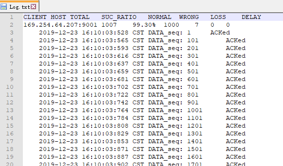
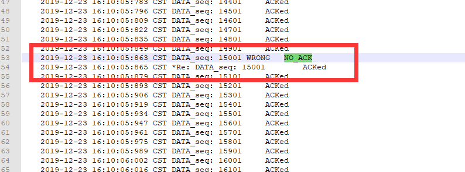
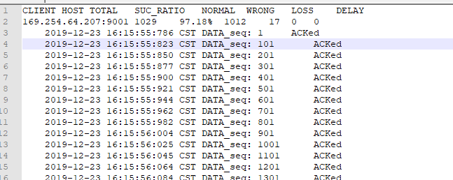
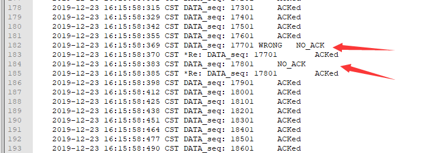
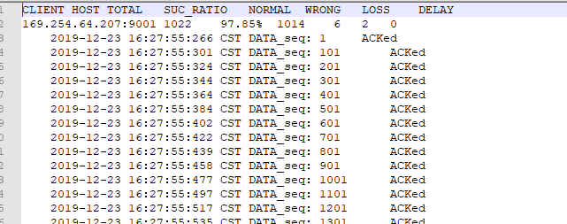
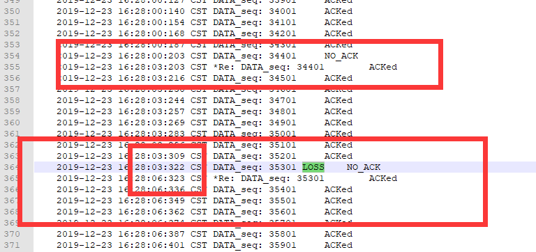
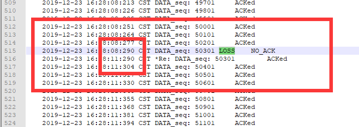

 实验报告要求：从实验数据文件中自己说明实现了相关功能

## RDT2.0 信道上可能出现位错

Log文件

## RDT2.2 ACK包可能出现位错

**仅使用ACK**

+ 接收方正确接收一个包后，发送ACK
+ 在ACK包中，接收方必须通过序号指明是对哪个数据包的确认

**重复的ACK包对发送方来说，和收到NACK的效果一样**

+ 重发当前数据包

## RDT3.0

DT3.0: 通道上可能出错和丢失数据
• 新的假设: 底层信道可
能丢包(数据或ACK)
– checksum, seq. #, 
ACK, 重发机制会有帮
助
• 如何处理数据丢失?
– 发送方可以等待，当某
些数据或ACK 丢失时, 
进行重传
– 想一想: 缺点?

• 方法: 发送方等待ACK一
段 “适当的” 时间
• 如果在这段时间里没有
收到ACK，则进行重传
• 如果分组(或 ACK)仅仅
被延迟了 (没有丢失):
– 重传将导致重复, 但使用
seq. # 可以控制
– 接收方必须指明被 ACK
分组所确认的 seq #
• 需要进行倒计时

## RDT4.0 选择响应协议

选择响应协议(Select Response)
• 接收方逐个对所有正确收到的分组进行应答
– 对接收到的（失序）分组进行缓存, 以便最后对
上层进行有序递交
• 发送方仅对未收到应答的分组进行重发
– 发送方为每个unACKed 分组设置计时器
• 发送方的窗口
– N 个连续的 seq #’s
– 同样对已发送的seq #s但未收到ACK的分组进行
限制