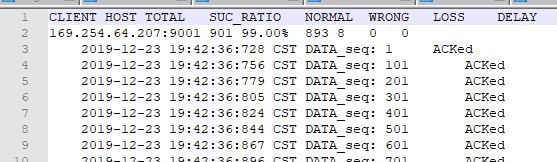
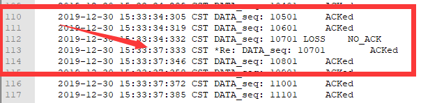
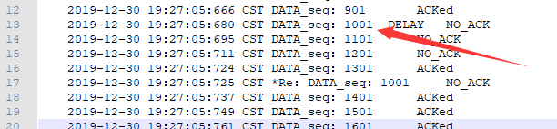

# 计算机网络大作业报告

**学号： <u>17140002050</u> 姓名： <u>谭坚铭</u> 专业： <u>计算机科学与技术</u> 年级： <u>2017</u>**      

[TOC]


# 1. 结合代码和LOG文件分析针对每个项目举例说明解决效果。（1-10分）

## 一. RDT2.0 信道上可能出现位错

### 1.代码分析

#### 1) 接收端

```java
//检查校验码，生成ACK		
if(CheckSum.computeChkSum(recvPack) == recvPack.getTcpH().getTh_sum()) {
    //生成ACK报文段（设置确认号）
    tcpH.setTh_ack(recvPack.getTcpH().getTh_seq());
    ackPack = new TCP_PACKET(tcpH, tcpS, recvPack.getSourceAddr());
    tcpH.setTh_sum(CheckSum.computeChkSum(ackPack));
    //回复ACK报文段
    reply(ackPack);

    if(recvPack.getTcpH().getTh_seq()!=sequence){
        //将接收到的正确有序的数据插入data队列，准备交付
        dataQueue.add(recvPack.getTcpS().getData());
        sequence=recvPack.getTcpH().getTh_seq();
        //sequence++;
    }else{
        System.out.println("收到重复包,重复seq:"+sequence);
    }

}else{
    System.out.println("校验失败");
    tcpH.setTh_ack(-1);
    ackPack = new TCP_PACKET(tcpH, tcpS, recvPack.getSourceAddr());
    tcpH.setTh_sum(CheckSum.computeChkSum(ackPack));
    //回复ACK报文段
    reply(ackPack);
}
```

接收端:对于接收到每一个包,检查其校验和

+ 若校验和匹配,则返回一个ack值为**本次接收到的包的seq值**的包,并将本次接收到的包插入data队列准备交付;
+ 若校验和不匹配,则返回一个ack值为-1的包

#### 2) 发送端

```java
//循环检查确认号对列中是否有新收到的ACK
while(true) {
    if(!ackQueue.isEmpty()){
        int currentAck=ackQueue.poll();
        System.out.println("CurrentAck: "+currentAck);
        if  (currentAck == tcpPack.getTcpH().getTh_seq()){
            System.out.println("Clear: "+tcpPack.getTcpH().getTh_seq());
            //用于3.0：
            //timer.cancel();
            break;
        }else{
            System.out.println("Retransmit: "+tcpPack.getTcpH().getTh_seq());
            udt_send(tcpPack);
        }
    }
}
```

发送端:每次发送一个包后,循环检查确认号对列中是否有新收到的ACK

+ 若新收到的ack等于刚刚发送包的seq,则结束本次循环,开始发送下一个包
+ 若接收到的ack值不为刚刚发送的seq,则重发之前发送的包,并继续等待ack

### 2.Log文件




分析日志文件可知,本次共有8个包发生了位错误(校验和匹配不成功),对于发生了位错误的包,接收端都马上进行了重发包,并且接收端成功接收到并返回对应ack包


## 二. RDT2.2 ACK包可能出现位错

### 1.代码分析

#### 1) 接收端

```java
		//检查校验码，生成ACK		
		if(CheckSum.computeChkSum(recvPack) == recvPack.getTcpH().getTh_sum()) {
			//生成ACK报文段（设置确认号）
			tcpH.setTh_ack(recvPack.getTcpH().getTh_seq());
			ackPack = new TCP_PACKET(tcpH, tcpS, recvPack.getSourceAddr());
			tcpH.setTh_sum(CheckSum.computeChkSum(ackPack));
			//回复ACK报文段
			reply(ackPack);

			if(recvPack.getTcpH().getTh_seq()!=sequence){
				//将接收到的正确有序的数据插入data队列，准备交付
				dataQueue.add(recvPack.getTcpS().getData());
				sequence=recvPack.getTcpH().getTh_seq();
				//sequence++;
			}else{
				System.out.println("收到重复包,重复seq:"+sequence);
			}

		}else{
			System.out.println("校验失败");
			tcpH.setTh_ack(-1);
			ackPack = new TCP_PACKET(tcpH, tcpS, recvPack.getSourceAddr());
			tcpH.setTh_sum(CheckSum.computeChkSum(ackPack));
			//回复ACK报文段
			reply(ackPack);
		}
```


**接收端回复包中仅使用ACK,与RDT2.0的代码类似**

+ 接收方正确接收一个包后，发送ACK
+ 在ACK包中，接收方必须通过序号指明是对哪个数据包的确认

**接收方需要记录上次接收的包的seq值,若与本次接收的相同,则不能将它插入data队列**

#### 2) 发送端

```java
	//接收到ACK报文：检查校验和，将确认号插入ack队列;NACK的确认号为－1；3.0版本不需要修改
	public void recv(TCP_PACKET recvPack) {
		if(CheckSum.computeChkSum(recvPack)==recvPack.getTcpH().getTh_sum()){
			System.out.println("Receive ACK Number： "+ recvPack.getTcpH().getTh_ack());
			ackQueue.add(recvPack.getTcpH().getTh_ack());
			System.out.println();
		}else{
			System.out.println("Receive Wrong ACK Number： ");
			ackQueue.add(-1);
			System.out.println();
		}
	}
```

发送端收到发生位错误的ack包时,认为接收方没有正确收到该包,故重复发送本次包

### 2.Log文件分析


分析Log文件可知,对于发送端发送的数据包发生的位错误(**WRONG NO_ACK**),接收端能够检测出并返回对应ack让接收端重发

对于接收端发生的ack包发生的位错误(**NO_ACK**),发送端也能检测出并进行包重发

## 三. RDT3.0 通道上可能出错和丢失数据

### 1.代码分析

#### 1) 接收端

接收端代码与之前相同

#### 2) 发送端

```java
class My_UDT_RetransTask extends TimerTask {
		private Client senderClient;
		private TCP_PACKET reTransPacket;

		public My_UDT_RetransTask(Client client, TCP_PACKET packet){
			this.senderClient = client;
			this.reTransPacket = packet;
		}

		@Override
		public void run() {
			System.out.println("超时重发包");
			this.senderClient.send(this.reTransPacket);
		}
	}
```


```java
//用于3.0版本：设置计时器和超时重传任务
timer = new UDT_Timer();
UDT_RetransTask reTrans = new UDT_RetransTask(client, tcpPack);

//每隔3秒执行重传，直到收到ACK
timer.schedule(reTrans, 3000, 3000);
```

发送本次数据包后,开启一个计时器,三秒内若未收到ack则重发本次数据包

```java
while(true) {
			if(!ackQueue.isEmpty()){
				int currentAck=ackQueue.poll();
				System.out.println("CurrentAck: "+currentAck);

				if  (currentAck == tcpPack.getTcpH().getTh_seq()){
					System.out.println("Clear: "+tcpPack.getTcpH().getTh_seq());

					//用于3.0：停止等待时需关闭计时器
					System.out.println("关闭计时器");
					timer.cancel();
					break;
				}else{
					System.out.println("Retransmit: "+tcpPack.getTcpH().getTh_seq());
					udt_send(tcpPack);
					//break;
				}
			}
		}
```

当收到本次数据包时,需要将该数据包对应的计时器关闭

### 2.Log文件分析




分析Log文件,当发生丢包时(**LOSS NO_ACK**),发送端会在3s后自动重发包


## 四. RDT4.0 选择响应协议

### 1.代码分析

#### 1) 接收端

```java
	public void addRecvPacket(TCP_PACKET packet){
		// 判断是否有序
		int seq=packet.getTcpH().getTh_seq();
		if((seq==lastSaveSeq+lastLength)||lastSaveSeq==-1){
			lastLength=packet.getTcpS().getData().length;
			lastSaveSeq=seq;
			waitWrite(packet);
		}else if(seq>lastSaveSeq){
			System.out.println("缓存seq:"+seq+"到列表,last is:"+lastSaveSeq);
			recvContent.add(new Window(packet));
		}
	}
```

接收端对于每一个校验和正确的接收包,都进行应答

+ 若接收到的包的seq有序,则执行waitWrite()函数将其递交给上层
+ 若收到的包的seq失序,则缓存到一个有序集合recvContent里


```java
	public void waitWrite(TCP_PACKET packet){
		int seq;

		File fw = new File("recvData.txt");
		BufferedWriter writer;
		SimpleDateFormat df = new SimpleDateFormat("yyyy-MM-dd HH:mm:ss");//设置日期格式
		try {
			writer = new BufferedWriter(new FileWriter(fw, true));
			Window window;
			int[] data=packet.getTcpS().getData();
			for(int i = 0; i < data.length; i++) {
				writer.write(data[i] + "\n");
			}
			writer.flush();		//清空输出缓存
			Iterator<Window> it=recvContent.iterator();
            // 在缓存队列里看是否还有有序的包,一起向上递交
			while (it.hasNext()){
				window=it.next();
				seq=window.packet.getTcpH().getTh_seq();
				data=window.packet.getTcpS().getData();
				if(seq==lastSaveSeq+lastLength){// 判断是否有序
					lastLength=packet.getTcpS().getData().length;
					lastSaveSeq=seq;
					for(int i = 0; i < data.length; i++) {
						writer.write(data[i] + "\n");
					}
					writer.flush();		//清空输出缓存
					it.remove();
				}
				else{
//					System.out.println("退出循环,当前seq为:"+seq+" last:"+lastSaveSeq);
					break;
				}
			}
			writer.close();

		} catch (IOException e) {
			e.printStackTrace();
		}
	}
```

waitWrite()函数功能: 将本次有序包递交给上层,并检查缓存队列里否还有有序的包,一起向上递交

#### 2) 发送端

```java
		while (!sendWindow.continueSend()){
			try {
				Thread.sleep(10);
			} catch (InterruptedException e) {
				e.printStackTrace();
			}
		}
```

发送端每发送一个包则判断当前窗口是否还有空闲,若有则发送下一个包,若无则等待窗口空闲.这里固定窗口大小为100


```java
	public void waitOvertime() {
		TimerTask dealOverTime = new TimerTask() {
			@Override
			public void run() {
				int index = startWindowIndex;
				boolean updateStart=true;
				Window window;
				while (index < endWindosIndex) {
					// 如果第index个包超时了
					window = sendContent.get(index);
					if(updateStart && window.ack){
						startWindowIndex=index+1;
						logger.info("更新start值:"+startWindowIndex);
					}else if(!window.ack){
						updateStart=false;
						if (TIMEOUTTIME < (System.currentTimeMillis() - window.getStartSendTime())) {
							//  它没有收到ack,则尝试重发
							sendWindow(window,false);
						}
					}
					index++;
				}
			}
		};
		new Timer().schedule(dealOverTime, 0, 200);
	}
```

发送端处理超时的包,从滑动窗口头开始逐个检查是否超时,如果有超时且未收到ack的包,则进行重发,若头部的有新的连续ack,则更新窗口头部的下标


### 2.Log文件分析


分析Log文件,对于NOACK的包,都能在超时的时候进行重发包

## 五. 拥塞控制

### 1.代码分析

#### 1) 接收端

```java
	public int addRecvPacket(TCP_PACKET packet){
		int seq=packet.getTcpH().getTh_seq();
		if(seq==lastSaveSeq+lastLength || lastSaveSeq==-1){
			lastLength=packet.getTcpS().getData().length;
			lastSaveSeq=seq;
			contentList.add(packet);
			waitWrite();
			logger.info("有序接收,缓存seq:"+seq+"到列表,返回ack:"+lastSaveSeq);
		}else if(seq>lastSaveSeq){
			recvBuffer.add(packet);
			logger.info("失序接收,缓存seq:"+seq+"到列表,返回ack:"+lastSaveSeq);
		}
		return lastSaveSeq;
	}
```

与选择响应协议一致,对于每一个校验和正确的接收包,都进行应答

+ 若接收到的包的seq有序,则执行waitWrite()函数将其递交给上层
+ 若收到的包的seq失序,则缓存到一个有序集合recvContent里


#### 2) 发送端

```java
	void dealWithOvertime() {
		TimerTask dealOverTime = new TimerTask() {
			@Override
			public void run() {
				int index = startWindowIndex;
				Window window;
				while (index <= ackWindowIndex) {
					// 如果第index个包超时了
					window = sendContent.get(index);
					if (TIMEOUTTIME < (System.currentTimeMillis() - window.getStartSendTime())) {
						//  它没有收到ack,则尝试重发
						if (!window.isAck()) {
							sendWindow(sendContent.get(index),1);
							break;
						}
					}
					index++;
				}
			}
		};
		new Timer().schedule(dealOverTime, 0, 1000);
	}
```

发送端处理超时的包,从滑动窗口头开始逐个检查是否超时,如果有超时且未收到ack的包,则进行重发


```java
	public void recv(TCP_PACKET recvPack){
		boolean isBadNet = false;
		Window window = null;
		int ackNum=recvPack.getTcpH().getTh_ack();
		logger.info("接收到ack:"+ackNum);

		int ackIndex=indexMap.get(ackNum);
		if(ackIndex>=startWindowIndex){
			// 如果收到的不是延迟到达的包,则处理
			int tempSeq;
			int index=startWindowIndex;

			// 当滑动窗口还有空间
			for (; index <=ackWindowIndex ; index++) {
				window=sendContent.get(index);
				tempSeq=window.packet.getTcpH().getTh_seq();

				// 包里的ack 大于滑动窗口里Index下标对应包的窗口的话,说明前面的也收到了
				if (ackIndex >= indexMap.get(tempSeq)) {
					logger.info(getWindowInfo()+"接收到ackNum:"+tempSeq+" (大于当前)index为:"+index+"的窗口块已经ack");
					window.setAck(true);
				} else {
					// 该窗口的ack数量+1
					window.setDuplicateAckNum(window.getDuplicateAckNum() + 1);

					// 如果该包收到3次ack时,说明网络拥塞
					if ((window.getDuplicateAckNum() >= MAX_Duplicate_NUM)&&(!window.isAck())) {
						isBadNet = true;
					}
					break;
				}
			}
			updateWindowSize(ackIndex);
		}else{
			logger.warning("收到延迟ack包,ackIndex值:"+ackIndex);
		}

		if (isBadNet) {
			// 拥塞避免 如果有包被重复收到MAX_Duplicate_NUM次以上,说明网络不好,缩小窗口
			int oldSsthresh=ssthresh;
			ssthresh = Math.max((cwnd / 2),2);
			// TCP Tahoe方式
			// cwnd = 1;

			// TCP Reno方式
			cwnd=oldSsthresh+1;//快速回恢复

			logger.warning(String.format(getWindowInfo()+"网络拥挤,设置新门限:%d,阻塞窗口大小为:%d, 当前窗口范围(%d,%d),acknum=%d\n", ssthresh,cwnd,startWindowIndex,endWindosIndex,ackWindowIndex));

			// 快速重传
			updateWindowSize(ackIndex);
			window.setDuplicateAckNum(0);
			sendWindow(window,2);

		}else {
			// 网络状况良好,增大滑动窗口
			cwnd=(cwnd <= ssthresh)?cwnd*2:cwnd+1;// 加法增大
			if(cwnd>MAX_Window_Size){
				cwnd=MAX_Window_Size;
			}
			updateWindowSize(ackIndex);
			logger.info(String.format(getWindowInfo()+"网络良好,设置阻塞窗口大小:%d, 当前窗口范围(%d,%d),ackWindowIndex=%d\n", cwnd,startWindowIndex,endWindosIndex,ackWindowIndex));

		}

	}
```

对于一个到达的未出错的ack包(即校验和正确的包)

发送端先判断是否延迟到达的包(比较接收到的ack值和当前的滑动窗口左沿的ack来判断)

+ 若收到的不是延迟到达的包,则更新滑动窗口的左沿,并将ack值对应的窗口及其左边的窗口设置为已经ack,并将ack值对应的下一个窗口的DuplicateAckNum+1, 若此时该窗口的DuplicateAckNum大于等于3,说明此时网络环境差,则设置isBadNet为true,表示需要进行拥塞控制


##### 快速恢复\乘法减小

当isBadNet为true,进行拥塞避免, 窗口门限设置为当前窗口大小的1/2(**乘法减小**),窗口大小cwnd设置为原来的门限值+1(**Reno方式,快速恢复**), 并进行快速重传,发送接收端返回的ack对应的下一个窗口的包

##### 加法增大

当isBadNet为false时,网络良好, 增大滑动窗口, 当窗口值不大于门限值时,平方增大,大于门限值时,采用加法增大


### 2.Log文件分析


#### 快速重传证明




查看Log文件发现1001的包是延迟到达的,观察发送端的日志RDTSender.log 如下


在发送第seq为1001的包后,连续收到了三个ack为901的包(因为首次发送的1001的包延迟了),此时发送端执行快速重传,重新发送1001的包,之后接收到了ack值为1301的包

#### 慢开始证明


#### 加法增大证明


#### 拥塞避免\乘法减小证明


检测到网络拥挤时, 新门限的值为原来的窗口大小的1/2(原来窗口大小为39,故新门限为19);新的窗口大小设置为原来的门限大小+1(原来的门限大小为16,即新窗口大小为17). 

下次接收到ack包且网络良好时,由于17小于门限19,故指数增大,新窗口大小为34


 

# 2. 说明在实验过程中采用迭代开发的优点或问题。(优点或问题合理：1分)

在本次实验中采用迭代开发的优点是可以把一个复杂的问题分解成几个关联较小的子问题,通过依次将子问题解决的方式最终将复杂问题解决.每一个子问题都能做好相关的测试,保证本部分的代码逻辑是正确的,防止了直接解决一个复杂问题的时候出现bug难以确定bug位置的情况出现.

 

# 3. 总结完成大作业过程中已经解决的主要问题和自己采取的相应解决方法(1分)

1) 实验代码中发送端发送代码的函数是由老师给定的代码进行调用的,在做选择响应以及拥塞控制时候,对发送窗口的管理不方便

解决方案:在发送函数rdt_send() 下面增加一个循环判断是否有空闲窗口的代码块,每次发送一个包之后则判断一次,若有空闲窗口,直接发送下一个包,若无空闲窗口,则程序会阻塞在这里,直至出现空闲窗口后再继续发送

 

2) 接收包的函数是多线程调用的,出现问题难以调试

使用日志类,将每次发送,接收过程中的详细信息都记录在日志里.程序完后可对日志文件进行分析从而得出程序是否照期运行.

 

# 4. 对于实验系统提出问题或建议(1分)

可以拓展要求使用UDP协议来实现RDT,并在真实的网络环境下使用实现的RDT进行大型文件传输,从而判断实现的可靠传输和拥塞控制的正确性及效果.